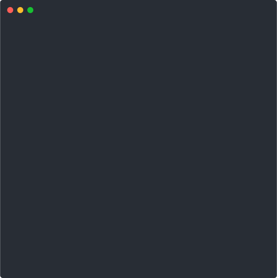

# devstats



> A CLI application that fetches stats from developer sites.

[](https://www.npmjs.com/package/devstats)

DevStats is a CLI application written in TypeScript that fetches statistics from "developer sites" like StackOverflow, WakaTime and GitHub and displays them nicely.

## Installation

Install it globally using:

```console
$ npm install -g devstats
```

Or if you're using Yarn:

```console
$ yarn global add devstats
```

## Usage

Add accounts from the [supported sites](#supported-sites):

```console
$ devstats add https://github.com/shroudedcode
```

Display your daily report:

```console
$ devstats
```

Display your daily report and switch between days using your keyboard:

```console
$ devstats -i
```

### Full list of commands

From `devstats --help`:

```console
Display the daily report for the current day:

$ devstats

Switch between days interactively:

$ devstats -i or devstats --interactive

Add a new account through its URL:

$ devstats add <url>
$ devstats add https://github.com/shroudedcode

Remove an account through its URL:

$ devstats remove <url>
$ devstats remove https://stackoverflow.com/users/6662225
```

### Supported sites

This is a list of sites currently supported by devstats. You can add your account using the name in parentheses.

- [GitHub](https://github.com) (`github`)
- [GitLab](https://gitlab.com) (`gitlab`)
- [StackOverflow](https://stackoverflow.com) (`stackoverflow`)
- [WakaTime](https://wakatime.com) (`wakatime`)
- [Hackerrank](https://hackerrank.com) (`hackerrank`)
- [Reverse Engineering SE](https://reverseengineering.stackexchange.com) (`reverseengineering`)
- [Code::Stats](https://codestats.net) (`codestats`)

Your favorite site is not on the list? Feel free to add support yourself and open a pull request.

## License

MIT © [Niklas Higi](https://shroudedcode.com)
